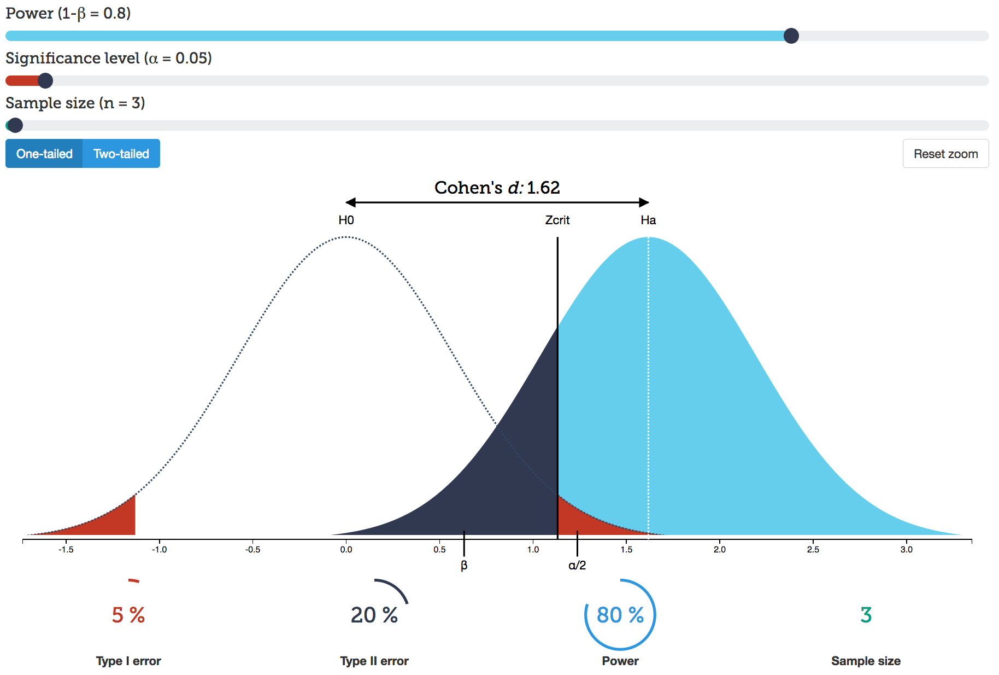

```{r setup, include=FALSE}
library(knitr)
options(htmltools.dir.version = FALSE, servr.daemon = TRUE)
opts_chunk$set(echo=F, message=F, warning = F, dev = 'svg', fig.align = 'center', fig.height = 4, size = "small")
library(tidyverse)
library(magrittr)
library(lubridate)
library(stringr)
library(ggthemes)
```

class: inverse, center, middle

# Introduction

---

### Poor reproducibility and replicability have become major concerns in experimental biomedical science


.footnote[
Image: [Rigorous replication effort succeeds for just two of five cancer papers](http://www.sciencemag.org/news/2017/01/rigorous-replication-effort-succeeds-just-two-five-cancer-papers)
]

---

### Reproducibility vs replication

- Reproducibility is the ability of reproducing, by using the original data, the original data analysis exactly
    - Reproducibility does not guarantee validity
- Replicability is the ability of reproducing, by new experiments, the original data approximately
    - Direct replication
    - Conceptual replication

.pull-left[
<center></center>
]

.pull-right[
<center></center>
]

.footnote[
Brian A Nosek, Timothy M Errington ["Reproducibility in cancer biology: Making sense of replications"](https://elife.elifesciences.org/content/6/e23383)
]

???

- Poor reproducibility (the inability of reproducing, by using the original data, the original data analysis exactly) and 
- replicability (the inability of reproducing, by new experiments, the original data approximately) have become major concerns in experimental biomedical science.

---

### What is the quality of a study?

- Whether it's worthwhile to replicate a study involves asking questions about the quality of this study
- The potential usefulness and feasibility of a replication study can be estimated from the results of the original study
- Standard approach -- The null hypothesis significance testing, deals with the quality of the experimental system in the long run rather than of the quality of a particular experiment, making it difficult to answer such questions

---

### The null hypothesis significance testing (NHST) is for long run quality control

- NHST controls specificity and sensitivity of the experimental system in the long-run
- Specificity $(\alpha)$ is the false positive rate
- Sensitivity $(1-\beta)$ is the statistical power of the test

<center></center>

---

### Statistical power

- Power equals the number of true effects (Ha) in the non-null bin divided by the number of true effects in both bins
- When testing a single H0, which happens to be true, we cannot make any inference from the resultant P value, which by itself carries no useful information 
- On the other hand, when the H0 is not true and our study is adequately powered, then the P value is likely to be close to zero
> If we perform experiment with predetermined statistical power, then small P value makes H0 less likely

```{r phistogram, cache=TRUE, fig.height=2, fig.width=4}
set.seed(20170407)
N <- 3000
H0 <- runif(N)
H1_0.8 <- replicate(t.test(rnorm(3,3.1), mu=0)$p.value, n = N)
H1_0.46 <- replicate(t.test(rnorm(3,2), mu=0)$p.value, n = N)
data_frame(H0,H1_0.8,H1_0.46) %>%
  gather %>% 
  ggplot(aes(value, ..density.., fill=key)) +
  geom_histogram(bins = 60, position = 'identity', alpha = 0.5) +
  geom_vline(xintercept = 0.05, linetype = 2) +
  scale_fill_colorblind() +
  theme(legend.title = element_blank()) +
  xlab("P value") 
# +
#   ggtitle("P value distributions when H0 is true vs H1 is true", subtitle = "H1 tests were simulated at two different power: 0.46 and 0.8. Vertical line denotes significance threshold.")

```


???

- However, estimating statistical power can be biased 
- Firstly, using meta-analysis of prior publications to determine the SD and ES for a prospective power study is likely to over-estimate the power 
- because studies, whose ES happen to be inflated by sampling error or bias, tend to seem more interesting and are thus more likely to be published than the studies that happen to underestimate the ES (or even those that get their effects right) 
- Such publication bias is pervasive in the biomedical literature

---

### Proportion of true nulls can be estimated using the flat part of P value histogram

- $\pi0$ is the proportion of true null hypotheses
- The q-value of a test is the proportion of false positives incurred when that particular test is called significant<sup>1</sup>

```{r qvalues, fig.height=3}
library(qvalue)
data(hedenfalk)
pvalues <- hedenfalk$p
qobj <- qvalue(p = pvalues)
p <- hist(qobj) + 
  theme_gray() +
  geom_vline(xintercept=0.05, linetype=2, size=1)
p$data <- p$data %>% filter(variable!="lfdr")
p + scale_linetype_discrete(guide=FALSE) +
  ggtitle("P value density histogram")
```

.footnote[
[1] Q-value estimation for false discovery rate control [qvalue package](http://bioconductor.org/packages/release/bioc/html/qvalue.html) from bioconductor.org.
]

---

### Statistical power cannot be estimated after the experiment 

```{r post-hoc-power, fig.height=4, fig.width=6}
load("data/post-hoc-power.RData")
guesses %>% 
  select(-x, -pwr) %>% 
  gather(variable, value, -n, -true.power) %>%
  ggplot(aes(x = true.power, y = value, color = variable)) +
  geom_point() +
  stat_smooth(span = 0.2, n = 100) +
  facet_wrap(~ n, labeller = label_bquote(cols = n ==~.(n))) +
  scale_y_continuous(breaks = seq(0, 1, by = 0.2), limits = c(0,NA)) +
  scale_x_continuous(breaks = seq(0, 1, by = 0.2), limits = c(NA,1)) +
  ylab("Fraction of post hoc power estimates") +
  xlab("True power") +
  ggtitle("Post hoc estimates of statistical power within +/- 10 percent points\nof true power (Good estimates).\nn = sample size.") +
  scale_color_colorblind() +
  theme(legend.title = element_blank())
```

.footnote[
- Because of random sampling post hoc statistical power is uncertain
]

---

class: inverse, center, middle

# From prospective to retrospective quality control

---

### Omics studies produce large numbers of P values from one study

- In omics we study the responses of many mRNAs/proteins to the experimental condition, resulting in as many distinct P values 
- These experiments are designed using the assumption that the relative levels of most mRNAs/proteins do not change upon experimental treatment

---

### Stable retrospective power (SRP)

- In the context of __many parallel measurements__ it is possible to assess the quality of a single experiment
- SRP is the fraction of statistically significant true discoveries from all true discoveries (significant or not)

$$ SRP = \frac{(1-FDR)\times d}{(1-\pi0)\times k}$$
> SRP can be calculated wherever there is a large family of parallel tests and FDR, $\pi0$, and q values are calculated

.footnote[
FDR, false discovery rate. d, number of detected effects. $\pi0$ the proportion of true null effects. k, number of total tests. R package to calculate SRP [devtools::install_github("tpall/SRP")](https://github.com/tpall/SRP)
]

???

- SRP can be calculated wherever there is a large family of parallel tests and FDR, $\pi0$, and q values are calculated

---

### Difference between SRP and conventional statistical power

- SRP combines the information present in a single test with the prior probability of the H0 (the $\pi0$), which is estimated laterally across hundreds or thousands of P values 
- While traditional prospective power is used to set the sensitivity of the experimental system in the context of many consecutive measurements 
> SRP is used in the context of many parallel measurements to assess the quality of a single experiment

---

### SRP of statistical tests simulated with known power

```{r}
load("data/simu_out_100_1528906.RData")
simu.out %>% 
  select(-fdr.power, -pi0.est) %>% 
  filter(SRP!=Inf, SRP<=1) %>% 
  gather(variable, value, -pi0.set) %>% 
  ggplot(aes(x = factor(pi0.set), y = value , color = variable)) +
  geom_boxplot(outlier.size = NULL, outlier.colour = "lightgray") +
  geom_jitter(position = position_jitterdodge()) +
  xlab(bquote(Proportion~of~true~H[0]*s~group("(",pi[0],")"))) +
  ylab(bquote(Power~group("(",q<0.05,")"))) +
  theme(legend.title = element_blank()) +
  scale_color_colorblind(labels = c("Stable\nretrospective\npower","True power"))

```

```{r, eval=FALSE, include=FALSE}
# Simulate P values
library(tidyverse)
library(magrittr)
simu_p_vals <- function(pi0, es, n) {
  H1 <- replicate((1-pi0)*n, t.test(rnorm(6, es), mu=0)$p.value)
  H0 <- replicate(pi0*n, t.test(rnorm(6, 0), mu=0)$p.value)
  list(H0=H0, H1=H1)
}
reps <- 10
pi0 <- c(0.5, 0.8, 0.9, 0.95)
es <- c(1.9,2.4,2.7,3)
parms <- expand.grid(pi0, es)
colnames(parms) <- c("pi0set", "es")
srp_simu <- sapply(parms, rep.int, times=reps) %>% as_data_frame()
srp_simu %<>% 
  mutate(pvalues = map2(pi0set, es, simu_p_vals, n=10000))
```


```{r SRP, eval=FALSE, include=FALSE}
# Calculate SRP
devtools::install_github("tpall/SRP")
library(SRP)
SRP <- srp_simu %>% mutate(SRP = map(pvalues, ~try(srp(unlist(.x)))))
```


```{r SRPvsTruePower, eval=FALSE, include=FALSE}
load("data/SRPvsTruePower_simu.RData")
ggplot(SRP, aes(Pow, SRP, color=factor(pi0set))) + 
  geom_point() +
  geom_smooth(method="lm") +
  coord_fixed() +
  xlab("True power (q<0.05)") +
  ggtitle("SRP compared to true power") +
  labs(color="Proportion\nof true H0") +
  scale_color_colorblind()
```

---

class: inverse, center, middle

# Let's give SRP a field test

---

### The GEO database

- GEO accepts next generation sequence data that examine quantitative gene expression, gene regulation, epigenomics or other aspects of functional genomics using methods such as RNA-seq, miRNA-seq, ChIP-seq, RIP-seq, HiC-seq, methyl-seq, etc

```{r geo-dynamics, fig.height=4}
load("data/CopyOfGEO_RNA-seq-dynamics.RData")
pdat <- ds %>% 
  select(PDAT, PubMedIds) %>% 
  mutate(pub=nchar(PubMedIds)!=0) %>% 
  group_by(PDAT) %>% 
  summarise(N = n(),
            pub = sum(pub)) %>% 
  mutate_at(vars(N, pub), cumsum)
pdat %<>% gather(key,value, -PDAT) 
pdat %>% ggplot(aes(ymd(PDAT), value, linetype = key)) + 
  geom_line() +
  ylab("Number of GEO Series") +
  xlab("Date") +
  # ggtitle("Cumulative number of high-throughput sequencing GEO Series") +
  scale_linetype_discrete(labels=c("GEO Series", "GEO Series with\npublications")) +
  theme(legend.position = c(.35, 0.8),
        legend.background = element_blank(),
        legend.title = element_blank(),
        legend.key = element_blank())
```

---

### Query

> 'expression profiling by high throughput sequencing[DataSet Type] AND ("Homo sapiens"[Organism] OR "Mus musculus"[Organism])'

- query retrieved 8670 GEO Series (Apr-24, 2017)


---

### Supplemental files

```r
suppfilenames <- ds %>%
*   filter(PDAT>"2015/12/24", PDAT<"2017/03/31",
         !inherits(SuppFileNames, "try-error"))

*   out <- c("tar","gtf","bed","bigbed","bedgraph","bw","wig","hic","gct(x)?","tdf",
*         "gff","pdf","png","zip","sif","narrowpeak","gff3","fa")

suppfiles_of_interest <- suppfilenames %>%
  unnest(SuppFileNames) %>%
*  filter(!str_detect(tolower(SuppFileNames),
*  "filelist|error|readme|annotation|raw.tar$|[:punct:]hic|hdf5$"),
         !str_detect(tolower(SuppFileNames), paste0(out, "(\\.gz)?$", collapse = "|")))
```

- GEO Series published between Dec-24 2015 and Mar-31 2017
- Keep only tables
- Try to exclude single cell seq experiments (some will sneak through, as scientists are really inventive in file (mis)labeling), Chr-IP peak files, pdf, png, readmes etc.

---

### GEO Series with (potentially interesting) supplemental files

```{r suppfilesofinterest}
load("data/suppfilenames_2017-04-01.RData")
load("data/GEO_suppfiles_to_download.RData")
load("data/GEO_retention.RData")
suppf <- suppfilenames %>% unnest(SuppFileNames)
suppf_downloaded <- suppf %>% filter(!str_detect(SuppFileNames, "time.*out|Server denied you to change"))
out <- c("tar","gtf","bed","bigbed","bedgraph","bw","wig","hic","gct(x)?","tdf",        "gff","pdf","png","zip","sif","narrowpeak","gff3","fa")
GEO_with_exp_summary <- suppf %>% filter(!str_detect(tolower(SuppFileNames), "filelist|error|readme|annotation|raw.tar$"))
suppfiles_of_interest <- suppf %>%
  filter(!str_detect(tolower(SuppFileNames), "filelist|error|readme|annotation|raw.tar$"),
         !str_detect(tolower(SuppFileNames), paste0(out, "(.gz)?$", collapse = "|"))) %>%
  select(Accession, SuppFileNames) %>%
  mutate(filext = str_extract(tolower(SuppFileNames), "\\.[:alpha:]+([:punct:][bgz2]+)?$"))
Count <- c(GEO_series_PDAT,
           length(unique(suppf$Accession)),
           length(unique(suppf_downloaded$Accession)),
     length(unique(GEO_with_exp_summary$Accession)),
     length(unique(suppfiles_of_interest$Accession)),
     GEO_after_import)
Step <- c('GEO Series, total',
          'GEO with suppfile names',
          'GEO with suppfile names\nsuccessfully downloaded',
          'GEO with summary\nsuppfile name in any format',
          'GEO with tabular experiment\nsummary suppfiles downloaded',
          'GEO tables after import')

data_frame(Step, Count) %>%
  ggplot(aes(Step, Count, group = 1)) +
  # geom_bar(stat='identity') +
  geom_text(aes(label = Count), vjust = "inward", hjust = "inward") +
  geom_point() +
  geom_line() +
  geom_text(x=3.5, y=3000, label = "Remove: readme, filelist,\nraw.tar etc. files") +
  scale_x_discrete(limits=rev(Step)) +
  scale_y_continuous(limits = c(0, 5000)) +
  coord_flip() +
  theme(axis.title.y = element_blank()) +
  ggtitle("GEO Series published between 2015/12/24 to 2017/03/31")
```

---

### Number of samples and features in high-throughput sequencing experiments

.pull-left[

```{r dims, results='asis'}
dims %>%
  select(-excelfiles,-idcols) %>%
  filter(features>8000) %>%
  summarise_at(c(3,5), funs("mean", "median")) %>%
  mutate_all(round) %>%
  gather %>%
  separate(key, c("var","stat")) %>%
  spread(var, value) %>%
  kable(format = 'html')
```

]

.pull-right[
```{r samples}
ggplot(dims, aes(samples, features)) +
  geom_hex() +
  geom_hline(yintercept = 8000, linetype = 3) +
  scale_x_log10() +
  scale_y_log10() +
  xlab("Number of samples") +
  ylab("Numbrer of features") +
  theme(aspect.ratio = 1,
        legend.title = element_blank(),
        legend.background = element_blank())

```
]

.footnone[
Summary table, threshold of 8000 rows/features was used to calculate mean and median. Features are transcripts, genomic locuses, etc. GEO series with ~ 1000 samples are single-cell sequencing experiments.
]

---

### We were looking for supplemental files including tables with:

1. raw P values
2. raw sequence read counts

```{r pvalues}
load("data/pvalues.RData")
pvalues <- tabs %>% filter(map_lgl(result, is.tibble))
pvalues %>%
  mutate(features = map_int(result, nrow)) %>%
  ggplot(aes(features)) +
  geom_histogram(bins=30) +
  scale_x_log10() +
  geom_vline(xintercept = 8000, linetype = 3) +
  xlab("Number of P values") +
  ggtitle(paste0("GEO Series with raw P values: ", length(unique(pvalues$Accession))," (", nrow(pvalues)," tables)"))
```

.footnone[
Threshold of 8000 was used to identify full expressome P values sets.
]

---

### GEO Series with raw sequence read counts

```{r counts, echo=TRUE}
esets <- tabs %>% filter(map_chr(result, ~class(.x)[1])=="ExpressionSet")
esets
```

`r length(unique(esets$Accession))` unique GEO Series

---

### Fit models

```{r edger, eval=FALSE, echo=TRUE}
# Identify vars for model fitting
esets %<>% mutate(groups = map(result, ~get_model_eset(pData(.x))))
library(edgeR); library(tidyverse); library(magrittr)
esets %<>% filter(map_lgl(result, ~nrow(exprs(.x))>8000)) %>%
  mutate(dge = pmap(list(result, groups, countfiles),
    function(x,y,z) {message(z); DGEList(counts=exprs(x), samples = y, genes = fData(x))})) %>%
  filter(!map_lgl(groups, is.null))
# Make design formulas and model.matrix
make_formula <- . %>% colnames %>% paste(collapse="+") %>% paste("~",.) %>% formula()
esets %<>% mutate(design = map(groups, make_formula))
esets %<>% mutate(design = map2(design, groups, ~model.matrix(object=.x, data=.y)))
# Filter genes with low counts: 3 or more samples with cpm of 10/L. L, # millions of counts in the smallest library
esets %<>% mutate(keep = map(dge, ~rowSums(cpm(.x)>10/min(.x$samples$lib.size)/1e6) >= 3),
                  dge_filt = map2(dge, keep, ~.x[.y,]))
# Recalculate library sizes and calculate normalisation factors
esets %<>% mutate(dge_filt = map(dge_filt, ~{.x$samples$lib.size <- colSums(.x$counts); .x}))
esets %<>% mutate(dge_filt = map2(countfiles, dge_filt, ~{message(.x); calcNormFactors(.y)}))
esets %<>% mutate(dge_filt = pmap(list(dge_filt, design, countfiles),
                                  function(x,y,z) {message(z); try(estimateDisp(x,y))}))
# Fit models
esets %<>% filter(!map_lgl(dge_filt, ~inherits(.x, "try-error"))) %>%
  mutate(fit = pmap(list(dge_filt, design, countfiles), function(x,y,z) {message(z); try(glmFit(x,y))})) %>%
  filter(!map_lgl(fit, ~inherits(.x, "try-error"))) %>%
  mutate(results = map(fit, ~glmLRT(.x, coef=2:ncol(.x$design))),
         toptags = map(results, topTags, n=Inf))
```

---

### Interpreting P value histograms

.pull-left[
- Make a histogram of your P values
- Look closely at your P value histograms as a first step in quality control
> Do this before you perform multiple hypothesis test correction, false discovery rate control, or any other means of interpreting your many P values<sup>1</sup>
]

.pull-right[

]

.footnote[
<sup>1</sup>How to interpret a P value histogram: [http://varianceexplained.org/statistics/interpreting-pvalue-histogram](http://varianceexplained.org/statistics/interpreting-pvalue-histogram/)
]

???

- P value histogram lets you get an immediate sense of how your test behaved across all your hypotheses, and immediately diagnose some potential problems

---

### Be careful with pathological cases

.pull-left[
Big bump in the middle? Bunch of random peaks? 

]

.pull-right[

]

.footnote[
Images: left, varianceexplained.org; right, Scafolk Council.
]

---

class: inverse, center, middle

# Results

---

### P value histograms, estimated pi0, and stable retrospective power


[Click for full table](HT-seq.html)

.footnote[
P values are from likelihood ratio tests where full model formula was compared against intercept-only formula.
]

---

### SRP versus proportion of true nulls

```{r srp-scatterplot}
library(plotly)
load("data/sparklines2.RData")
p %>%
  ggplot(aes(pi0, SRP, color=id, label=str_extract(countfiles,"GSE[0-9]*"))) +
  geom_point() +
  scale_colour_colorblind() +
  labs(color='P values\norigin')
```


---

### SRP versus library size

```{r}
load("data/countdata_libsize.RData")
libsize <- countdata_libsize %>%
  group_by(countfiles, Accession) %>%
  mutate(libsize = map_dbl(libsize, mean))
p %>%
  filter(SRP<1) %>%
  group_by(countfiles) %>%
  summarise(SRP = mean(SRP, na.rm=T)) %>%
  inner_join(libsize) %>%
  ggplot(aes(SRP, log10(libsize), label = str_extract(countfiles,"GSE[0-9]*"))) +
  geom_point() +
  geom_smooth(method="lm") +
  ylab("Library size, log10")

```


---

### Acknowledgements

- Ülo Maiväli and Tanel Tenson, _Institute of Technology, University of Tartu_

.footnote[
email: taavi.pall@ttu.ee
]

