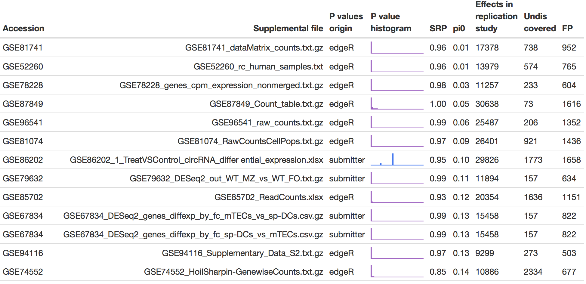

```{r setup, include=FALSE}
library(knitr)
options(htmltools.dir.version = FALSE, servr.daemon = TRUE)
opts_chunk$set(echo=F, message=F, warning = F, dev = 'svg', fig.align = 'center', fig.height = 4, size = "small")
library(tidyverse)
library(magrittr)
library(lubridate)
library(stringr)
library(ggthemes)
```

class: inverse, center, middle

# Let's test how SRP work in real life 

---

### The GEO database

- GEO accepts next generation sequence data that examine quantitative gene expression, gene regulation, epigenomics or other aspects of functional genomics using methods such as RNA-seq, miRNA-seq, ChIP-seq, RIP-seq, HiC-seq, methyl-seq, etc

```{r geo-dynamics, fig.height=4}
load("data/pdat_GEO_RNA-seq-dynamics.RData")
pdat %<>% gather(key,value, -PDAT) 
pdat %>% ggplot(aes(ymd(PDAT), value, linetype = key)) + 
  geom_line() +
  ylab("Number of GEO Series") +
  xlab("Date") +
  # ggtitle("Cumulative number of high-throughput sequencing GEO Series") +
  scale_linetype_discrete(labels=c("GEO Series", "GEO Series with\npublications")) +
  theme(legend.position = c(.35, 0.8),
        legend.background = element_blank(),
        legend.title = element_blank(),
        legend.key = element_blank())
```

---

### Query

> 'expression profiling by high throughput sequencing[DataSet Type] AND ("Homo sapiens"[Organism] OR "Mus musculus"[Organism])'

- query retrieved 8670 GEO Series (Apr-24, 2017)


---

### Supplemental files

```r
suppfilenames <- ds %>%
*   filter(PDAT>"2015/12/24", PDAT<"2017/03/31",
         !inherits(SuppFileNames, "try-error"))

*   out <- c("tar","gtf","bed","bigbed","bedgraph","bw","wig","hic","gct(x)?","tdf",
*         "gff","pdf","png","zip","sif","narrowpeak","gff3","fa")

suppfiles_of_interest <- suppfilenames %>%
  unnest(SuppFileNames) %>%
*  filter(!str_detect(tolower(SuppFileNames),
*  "filelist|error|readme|annotation|raw.tar$|[:punct:]hic|hdf5$"),
         !str_detect(tolower(SuppFileNames), paste0(out, "(\\.gz)?$", collapse = "|")))
```

- GEO Series published between Dec-24 2015 and Mar-31 2017
- Keep only tables
- Try to exclude single cell seq experiments (some will sneak through, as people are really inventive in file (mis)labeling), Chr-IP peak files, pdf, png, readmes etc.

---

### GEO Series with (potentially interesting) supplemental files

```{r suppfilesofinterest}
load("data/suppfilesofinterest.RData")
data_frame(Step, Count) %>%
  ggplot(aes(Step, Count, group = 1)) +
  # geom_bar(stat='identity') +
  geom_text(aes(label = Count), vjust = "inward", hjust = "inward") +
  geom_point() +
  geom_line() +
  geom_text(x=3.5, y=3000, label = "Remove: readme, filelist,\nraw.tar etc. files") +
  scale_x_discrete(limits=rev(Step)) +
  scale_y_continuous(limits = c(0, 5000)) +
  coord_flip() +
  theme(axis.title.y = element_blank()) +
  ggtitle("GEO Series published between 2015/12/24 to 2017/03/31")
```

---

### Number of samples and features in high-throughput sequencing experiments

.pull-left[

```{r dims, results='asis'}
load("data/GEO_retention.RData")
dims %>%
  select(-excelfiles,-idcols) %>%
  filter(features>8000) %>%
  summarise_at(c(3,5), funs("mean", "median")) %>%
  mutate_all(round) %>%
  gather %>%
  separate(key, c("var","stat")) %>%
  spread(var, value) %>%
  kable(format = 'html')
```

]

.pull-right[
```{r samples}
ggplot(dims, aes(samples, features)) +
  geom_hex() +
  geom_hline(yintercept = 8000, linetype = 3) +
  scale_x_log10() +
  scale_y_log10() +
  xlab("Number of samples") +
  ylab("Numbrer of features") +
  theme(aspect.ratio = 1,
        legend.title = element_blank(),
        legend.background = element_blank())

```
]

.footnone[
Summary table, threshold of 8000 rows/features was used to calculate mean and median. Features are transcripts, genomic locuses, etc. GEO series with ~ 1000 samples are single-cell sequencing experiments.
]

---

### We were looking for supplemental files including tables with:

1. Unadjusted raw P values
2. Raw sequence read counts (not CPM, RPKM)

```{r pvalues}
load("data/pvalues_features.RData")  
ggplot(pvalues, aes(features)) +
  geom_histogram(bins=30) +
  scale_x_log10() +
  geom_vline(xintercept = 8000, linetype = 3) +
  xlab("Number of P values") +
  ggtitle(paste0("GEO Series with raw P values: ", length(unique(pvalues$Accession))," (", nrow(pvalues)," tables)"))
```

.footnone[
Threshold of 8000 was used to identify full expressome P values sets.
]

---

### GEO Series with raw sequence read counts


96 unique GEO Series

---


---

### Fit models

```{r edger, eval=FALSE, echo=TRUE}
# Identify vars for model fitting
esets %<>% mutate(groups = map(result, ~get_model_eset(pData(.x))))
library(edgeR); library(tidyverse); library(magrittr)
esets %<>% filter(map_lgl(result, ~nrow(exprs(.x))>8000)) %>%
  mutate(dge = pmap(list(result, groups, countfiles),
    function(x,y,z) {message(z); DGEList(counts=exprs(x), samples = y, genes = fData(x))})) %>%
  filter(!map_lgl(groups, is.null))
# Make design formulas and model.matrix
make_formula <- . %>% colnames %>% paste(collapse="+") %>% paste("~",.) %>% formula()
esets %<>% mutate(design = map(groups, make_formula))
esets %<>% mutate(design = map2(design, groups, ~model.matrix(object=.x, data=.y)))
# Filter genes with low counts: 3 or more samples with cpm of 10/L. L, # millions of counts in the smallest library
esets %<>% mutate(keep = map(dge, ~rowSums(cpm(.x)>10/min(.x$samples$lib.size)/1e6) >= 3),
                  dge_filt = map2(dge, keep, ~.x[.y,]))
# Recalculate library sizes and calculate normalisation factors
esets %<>% mutate(dge_filt = map(dge_filt, ~{.x$samples$lib.size <- colSums(.x$counts); .x}))
esets %<>% mutate(dge_filt = map2(countfiles, dge_filt, ~{message(.x); calcNormFactors(.y)}))
esets %<>% mutate(dge_filt = pmap(list(dge_filt, design, countfiles),
                                  function(x,y,z) {message(z); try(estimateDisp(x,y))}))
# Fit models
esets %<>% filter(!map_lgl(dge_filt, ~inherits(.x, "try-error"))) %>%
  mutate(fit = pmap(list(dge_filt, design, countfiles), function(x,y,z) {message(z); try(glmFit(x,y))})) %>%
  filter(!map_lgl(fit, ~inherits(.x, "try-error"))) %>%
  mutate(results = map(fit, ~glmLRT(.x, coef=2:ncol(.x$design))),
         toptags = map(results, topTags, n=Inf))
```

---

### Interpreting P value histograms

.pull-left[
- Make a histogram of your P values
- Look closely at your P value histograms as a first step in quality control
> Do this before you perform multiple hypothesis test correction, false discovery rate control, or any other means of interpreting your many P values<sup>1</sup>
]

.pull-right[

]

.footnote[
<sup>1</sup>How to interpret a P value histogram: [http://varianceexplained.org/statistics/interpreting-pvalue-histogram](http://varianceexplained.org/statistics/interpreting-pvalue-histogram/)
]

???

- P value histogram lets you get an immediate sense of how your test behaved across all your hypotheses, and immediately diagnose some potential problems

---

### Be careful with pathological cases

.pull-left[
Big bump in the middle? Bunch of random peaks? 

]

.pull-right[

]

.footnote[
Images: left, varianceexplained.org; right, Scafolk Council.
]

---

class: inverse, center, middle

# Results

---

### Function to calculate srp

```{r, echo=TRUE}
devtools::install_github("tpall/SRP")
library(SRP)
pvals <- runif(1000)
out <- try(srp(pvals))
out
```


---
### P value histograms, estimated pi0, and stable retrospective power



[Click for full table](pvalue-histograms.html)

.footnote[
P values are from likelihood ratio tests where full model formula was compared against intercept-only formula.
]

---

### SRP versus proportion of true nulls

```{r srp-scatterplot}
library(plotly)
load("data/sparklines2_plot-sparks.RData")
p %>%
  ggplot(aes(pi0, SRP, color=id, label=str_extract(countfiles,"GSE[0-9]*"))) +
  geom_point() +
  scale_colour_colorblind() +
  labs(color='P values\norigin') +
  xlab(expression(pi*0))
```


---

### SRP versus library size

```{r srp-libsize}
load("data/countdata_libsize.RData")
libsize <- countdata_libsize %>%
  group_by(countfiles, Accession) %>%
  mutate(libsize = map_dbl(libsize, mean))
p %>%
  filter(SRP<1) %>%
  group_by(countfiles) %>%
  summarise(SRP = mean(SRP, na.rm=T)) %>%
  inner_join(libsize) %>%
  ggplot(aes(SRP, log10(libsize), label = str_extract(countfiles,"GSE[0-9]*"))) +
  geom_point() +
  geom_smooth(method="lm") +
  ylab("Library size, log10")

```


---

### Acknowledgements

- Ülo Maiväli and Tanel Tenson, _Institute of Technology, University of Tartu_
- Read more about GEO RNA-seq project in [blog.credibleinterval.ee](https://blog.credibleinterval.ee)


.footnote[
email: taavi.pall@ttu.ee
]

